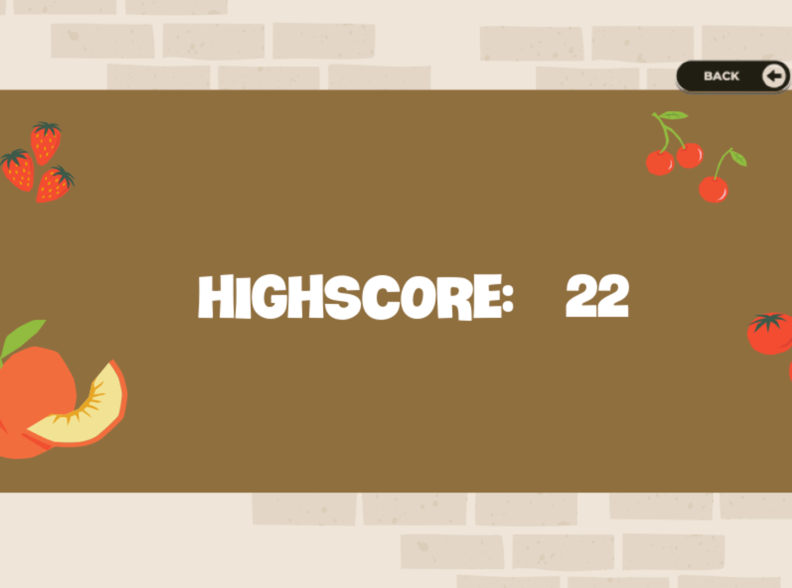
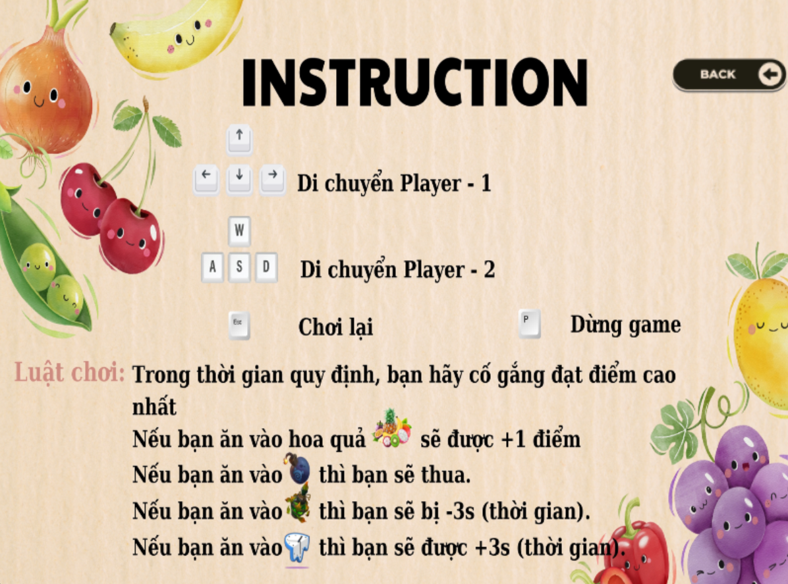
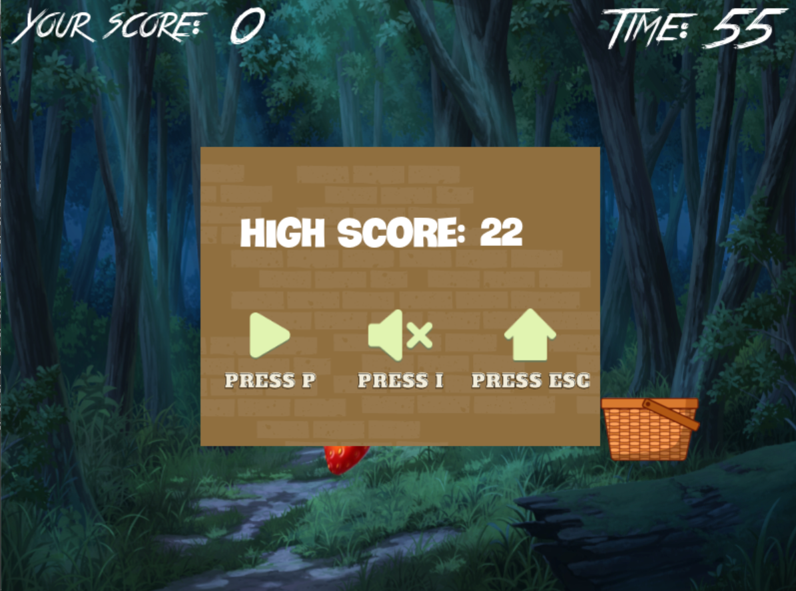

# **FRUIT BASKET**  
## GIỚI THIỆU  
**Họ và tên**: `Nguyễn Quang Hiếu`  
**Mã sinh viên**: `23021551` `K68CA1` `Trường Đại học Công nghệ` `Đại học Quốc gia Hà Nội`  

**Ý tưởng** : Đây là một chủ đề bài tập lớn của môn học `Lập Trình Nâng Cao`. Ý tưởng dựa vào game `Chuột ăn phô mai` mà cô Châu đã demo, game được viết bằng ngôn ngữ lập trình `C++` và sử dụng thư viện `SDL`  

## CÀI ĐẶT  
1. Sao chép repository này về máy tính của bạn  
2. Cài đặt IDE `CodeBlock` và các thư viện `SDL` `SDL_image` `SDL_ttf` và `SDL_mixer`  
3. Mở file `FRUITS_BASKET.cbp` trong thư mục vừa tải về  
4. Click chuột vào `Build & Run` hoặc `F9` để chạy trò chơi  
## MỘT SỐ HÌNH ẢNH TRONG GAME
  
  
  
  
## NHỮNG KIẾN THỨC ĐÃ SỬ DỤNG  
+ Sử dụng những kiến thức cơ bản của lập trình: vòng lặp, xâu, struct, con trỏ, sinh số ngẫu nhiên, hàm,...  
+ Chia poject ra các file để dễ quản lí  
+ Game có hoạt hình (vật di chuyển: theo đường thẳng, theo hình sin), âm thanh, nhạc nền, hiển thị text, xử lí va chạm( giữa hai vật thể, giữa vật thể với khung game)  
+ Ghi đọc file để ghi dữ liệu kết quả của người chơi  

## NGUỒN  
### *Hướng dẫn*  
[`Lazyfoo`](https://lazyfoo.net/tutorials/SDL/index.php)  

[`ChatGPT4`](https://chat.openai.com)  
Những phần như [`graphics`] tham khảo từ [`Code mẫu`]  

### *Đồ họa*
Đồ họa trong game đa phần lấy từ [`pinterest`](https://www.pinterest.com/)  
Web hỗ trợ thiết kế ( xóa phông ) [`Remove.bg`](https://www.remove.bg/upload)  
Còn lại giao diện chính, các nút tự thiết kế bằng [`Canva`](https://www.canva.com/)  

### *Âm thanh*
Tham khảo từ [`Youtube`](https://www.youtube.com/) và [`itch.io`](https://itch.io/)  
 
## TỰ ĐÁNH GIÁ  
Dưới là một số luận điểm nâng cao band điểm ( đã dựa vào barem điểm mà giảng viên đưa ra)  
+ Ý tưởng game đa phần khác với mặt bằng chung của lớp (Flappy bird, Game bắn súng, Game Dino Swords, ...) nên không có nguồn tham khảo về các phần mà mình phát triển này do đó 90% là tự code. Vì tự code nên khả năng chia file, quản lí dự án chưa thực sự hiệu quả  
+ Gameplay có phát triển thêm chế độ 2 người chơi, có thể chơi lại nhiều lần  
+ Đồ họa, âm thanh được mình chọn lựa kỹ càng và thiết kế tỉ mỉ nên mình nhận thấy nó ở mức ổn  
+ Yếu điểm lớn là chưa áp dụng được Cấu trúc dữ liệu và Thuật toán nâng cao vào Game  
  
Từ những luận điểm đó, mình nghĩ band điểm sẽ ổn hơn mức 7.5 - 8.5 thậm chí có thể vào band 9-9.5 nếu được thầy động viên học tập    
## LỖI  
Khi chơi ở chế độ 2 người chơi, 2 đối tượng Basket di chuyển sẽ hơi bị delay nhẹ khi nhận thao tác bàn phím  
## CÁC TÍNH NĂNG TRONG TƯƠNG LAI  
+ Tạo ra nhiều loại quả Fruits hoặc các chướng ngại vật khác với các tính năng đặc biệt, sáng tạo hơn  
+ Mở thêm shop, tạo ra các Basket khác nhau để người chơi có thể trải nghiệm thêm các trang phục với các thiết kế và tính năng khác nhau  
+ Cho phép người chơi nhập tên người dùng  
+ Sáng tạo cốt truyện cho Game

## LIÊN HỆ  
[`Github`](https://github.com/hieunqlamit) [`Mail`](nguyenquanghieu1032005@gmail.com)  

