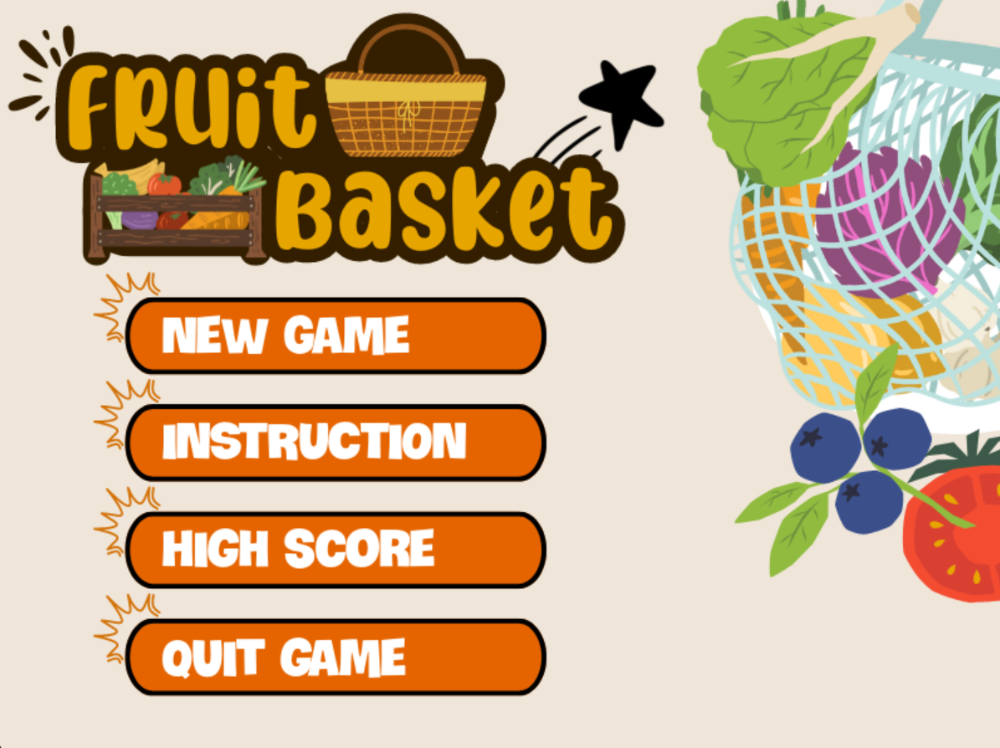

# **FRUIT BASKET**  
## GIỚI THIỆU  
**Họ và tên**: `Nguyễn Quang Hiếu`  
**Mã sinh viên**: `23021551` `K68CA1` `Trường Đại học Công nghệ` `Đại học Quốc gia Hà Nội`  

**Ý tưởng** : Đây là một chủ đề bài tập lớn của môn học `Lập Trình Nâng Cao`. Ý tưởng dựa vào game `Chuột ăn phô mai` mà cô Châu đã demo, game được viết bằng ngôn ngữ lập trình `C++` và sử dụng thư viện `SDL`  

## CÀI ĐẶT  
1. Sao chép repository này về máy tính của bạn  
2. Cài đặt IDE `CodeBlock` và các thư viện `SDL` `SDL_image` `SDL_ttf` và `SDL_mixer`  
3. Mở file `FRUITS_BASKET.cbp` trong thư mục vừa tải về  
4. Click chuột vào `Build & Run` hoặc `F9` để chạy trò chơi  
## MỘT SỐ HÌNH ẢNH TRONG GAME
  
![HighScore](

